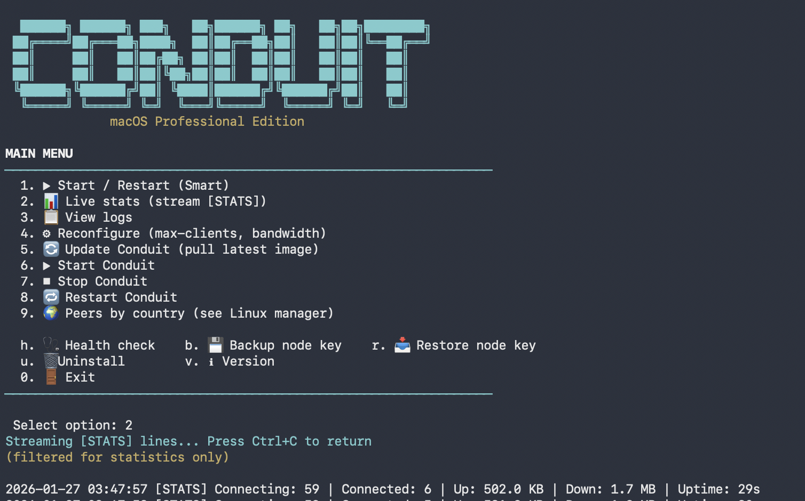

<div align="right">

[فارسی](#فارسی) | 🇬🇧 **English**

</div>

<div align="center">

# **Conduit** · **Snowflake** · **Xray** CLI

### Help Iranians access the open internet by running volunteer proxy nodes

**Conduit** — Psiphon volunteer proxy  
**Snowflake** — Tor proxy  
**Xray** — VLESS / VMess / REALITY

</div>

---

## 🚀 Installation

### Mac operating system (macOS)

**Option A: Docker** — Run Conduit in a container using Docker Desktop; no building, includes the manager and dashboard.

- **Step A.1** Download and install [Docker Desktop](https://www.docker.com/products/docker-desktop/) (Mac).  
  [](https://www.docker.com/products/docker-desktop/)
- **Step A.2** In Terminal, run:
  ```bash
  curl -sL https://raw.githubusercontent.com/farrox/Conduit-Snowflakes-and-X-ray-servers/main/scripts/conduit-manager-mac.sh | bash
  ```

**Option B: Native** — Install the native binary and run with the **Conduit manager** (same terminal dashboard and menu as Docker), no Docker required.

- **Step B.1** Clone this repo:
  ```bash
  git clone https://github.com/farrox/Conduit-Snowflakes-and-X-ray-servers.git
  cd Conduit-Snowflakes-and-X-ray-servers
  ```
- **Step B.2** Build the binary:
  ```bash
  make setup && make build
  ```
- **Step B.3** Run the **native manager** (same menu and dashboard as Docker Option A):
  ```bash
  ./scripts/conduit-manager-native.sh --menu
  ```

  

  Or start/restart directly: `./scripts/conduit-manager-native.sh` (no args)

📖 [Mac Installation Guide](docs/markdown/INSTALL_MAC.md)

---

### Linux operating system

**Option A: One-command install**

- **Step A.1** In a terminal, run:
  ```bash
  curl -sL https://raw.githubusercontent.com/farrox/Conduit-Snowflakes-and-X-ray-servers/main/scripts/install-linux.sh | sudo bash
  ```
- **Step A.2** (Optional) With custom settings:
  ```bash
  curl -sL https://raw.githubusercontent.com/farrox/Conduit-Snowflakes-and-X-ray-servers/main/scripts/install-linux.sh | MAX_CLIENTS=500 BANDWIDTH=10 sudo bash
  ```

📖 [Cloud Deployment Guide](docs/markdown/DEPLOY_CLOUD.md) · [Deployment Checklist](docs/reference/DEPLOY_TODO.md)

---

### Windows operating system

**Option A: Docker** — Run Conduit in Docker with the terminal dashboard manager.

- **Step A.1** Download and install [Docker Desktop](https://www.docker.com/products/docker-desktop/) (Windows).  
  [](https://www.docker.com/products/docker-desktop/)
- **Step A.2** Install **WSL2** (Windows Subsystem for Linux — gives you a Linux terminal on Windows). Open **PowerShell as Administrator** and run:
  ```powershell
  wsl --install
  ```
  This installs WSL2 and Ubuntu. Restart your computer when prompted.
- **Step A.3** Open **WSL2** (search "Ubuntu" in Start menu), then run:
  ```bash
  curl -sL https://raw.githubusercontent.com/farrox/Conduit-Snowflakes-and-X-ray-servers/main/scripts/conduit-manager-mac.sh | bash
  ```
  
  **Alternative:** Already have WSL2? Skip Step A.2. Don't want WSL2? Use Option B (native binary) below.

**Option B: Native** — Build the Windows binary from source (requires Go 1.24.x).

- **Step B.1** Clone this repo:
  ```bash
  git clone https://github.com/farrox/Conduit-Snowflakes-and-X-ray-servers.git
  cd Conduit-Snowflakes-and-X-ray-servers
  ```
- **Step B.2** Build for Windows:
  ```bash
  make setup
  make build-windows
  ```
  Binary will be at `dist/conduit-windows-amd64.exe`
- **Step B.3** Run in PowerShell or Command Prompt:
  ```powershell
  .\dist\conduit-windows-amd64.exe start --psiphon-config .\psiphon_config.json -v
  ```

📖 For firewall rules to restrict traffic to Iran: [Iran Conduit Firewall](https://github.com/SamNet-dev/iran-conduit-firewall)

📖 **Documentation:** [HTML docs](docs/index.html) · [Quick Start](docs/quickstart.html) · [Snowflake](docs/snowflake.html) · [Xray](docs/xray.html)

---

## 📋 Before You Start

You need a `psiphon_config.json` file. Create this file in the **repo root** (the main folder where you cloned the repo):

**Example paths:**
- **Mac:** `/Users/yourname/Conduit-Snowflakes-and-X-ray-servers/psiphon_config.json`
- **Linux:** `/home/yourname/Conduit-Snowflakes-and-X-ray-servers/psiphon_config.json`
- **Windows:** `C:\Users\yourname\Conduit-Snowflakes-and-X-ray-servers\psiphon_config.json`

**File contents:**

```json
{
    "PropagationChannelId": "1234FA5678BC90DE",
    "SponsorId": "9876AB1234CD5678",
    "AdditionalParameters": "VGhpcyBpcyBhIHZlcnkgbG9uZyBiYXNlNjQtZW5jb2RlZCBlbmNyeXB0ZWQgc3RyaW5nIGNvbnRhaW5pbmcgeW91ciBQc2lwaG9uIG5ldHdvcmsgYnJva2VyIGNvbmZpZ3VyYXRpb24uLi4gW3RoaXMgd2lsbCBiZSBhcm91bmQgMTUtMjBLQiBvZiBiYXNlNjQgZGF0YV0=",
    "DNSResolverCacheExtensionInitialTTLMilliseconds": 60000,
    "DNSResolverCacheExtensionVerifiedTTLMilliseconds": 86400000,
    "EmitDiagnosticNotices": true,
    "EmitDiagnosticNetworkParameters": true,
    "EmitServerAlerts": true,
    "ServerEntrySignaturePublicKey": "YOUR_SERVER_ENTRY_PUBLIC_KEY_HERE",
    "RemoteServerListSignaturePublicKey": "YOUR_REMOTE_SERVER_LIST_PUBLIC_KEY_HERE",
    "EnableFeedbackUpload": true,
    "FeedbackEncryptionPublicKey": "YOUR_FEEDBACK_ENCRYPTION_PUBLIC_KEY_HERE",
    "EnableUpgradeDownload": false
}
```

**What to change:**
- Replace `1234FA5678BC90DE` with your 16-character Psiphon channel ID (hex)
- Replace `9876AB1234CD5678` with your 16-character Psiphon sponsor ID (hex)
- Replace the `AdditionalParameters` value with your very long base64-encoded encrypted broker configuration (15-20KB)
- Replace the three public key placeholders with your actual public keys from Psiphon

**Where to get this config:**

**Mac:** Extract from the iOS Psiphon app (if you have Xcode/iOS development setup)
```bash
./scripts/extract-ios-config.sh
```

**Windows:** Extract from the Psiphon Windows GUI app (if you have it installed)
```powershell
.\scripts\extract-windows-config.ps1
```

**Linux:** Extract from the Psiphon Linux GUI app (if you have it installed)
```bash
./scripts/extract-linux-config.sh
```

**Don't have the GUI app?** Email Psiphon at `info@psiphon.ca` with subject "Request for Conduit CLI Configuration" — they'll send you the complete config file.

**Then save it:**
- **Mac:** Use **TextEdit** (Format → Make Plain Text), paste the config, save as `psiphon_config.json`
- **Linux:** `nano psiphon_config.json`, paste, `Ctrl+O`, `Ctrl+X`
- **Windows:** Use **Notepad**, paste, Save As `psiphon_config.json` (type: **All Files**)

📖 [Full Config Guide](docs/markdown/GET_CONFIG.md)

---

## ❄️ Snowflake Setup

Run a **Tor Snowflake proxy** alongside Conduit to help more people bypass censorship.

**Docker (one command):**
```bash
docker run -d --name snowflake --restart unless-stopped thetorproject/snowflake-proxy:latest
```

**From source:**
```bash
git clone https://gitlab.torproject.org/tpo/anti-censorship/docker-snowflake-proxy.git
cd docker-snowflake-proxy
docker compose up -d
```

📖 [Snowflake Guide](docs/snowflake.html) · [Markdown Guide](docs/markdown/SNOWFLAKE_WHERE_TO_START.md)

---

## 🔷 Xray Setup

Run an **Xray server** (VLESS/VMess/REALITY protocols) alongside Conduit for additional censorship resistance.

**Docker (one command):**
```bash
docker run -d --name xray --restart unless-stopped -v ./xray-config.json:/etc/xray/config.json teddysun/xray
```

**Requires:** `xray-config.json` file ([example config](https://github.com/XTLS/Xray-examples))

📖 [Xray Guide](docs/xray.html) · [Markdown Guide](docs/markdown/XRAY_WHERE_TO_START.md)

---

## 📚 Documentation

- **[HTML Docs](docs/index.html)** - Beautiful web-based guides
- **[Dashboard Guide](docs/markdown/DASHBOARD.md)** - Live stats in terminal
- **[Cloud Deployment](docs/markdown/DEPLOY_CLOUD.md)** - Deploy to VPS
- **[Security & Firewall](docs/markdown/SECURITY_FIREWALL.md)** - Restrict traffic to Iran
- **[Optimal Configuration](docs/markdown/CONFIG_OPTIMAL.md)** - Auto-calculate best settings
- **[All Guides](docs/markdown/)** - Complete documentation
- **[Acknowledgements](ACKNOWLEDGEMENTS.md)** - Community contributions

---

## 📝 License

GNU General Public License v3.0

---

## 🆘 Need Help?

1. Check the [HTML Documentation](docs/index.html) for visual guides
2. See the [Quick Start Guide](docs/markdown/QUICKSTART_MAC.md) for step-by-step instructions
3. Review the [troubleshooting section](docs/markdown/QUICKSTART_MAC.md#troubleshooting)
4. Open an issue on GitHub

---

<div align="center">

**Thank you for helping Iranians access the open internet!** 🌐

Made with ❤️ for internet freedom

</div>

---
---
---

<div id="فارسی"></div>

<div align="right" dir="rtl">

[🇬🇧 English](#top) | **فارسی**

</div>

<div align="center" dir="rtl">

# **Conduit** · **Snowflake** · **Xray** CLI

### با راه‌اندازی نودهای پروکسی داوطلبانه به ایرانیان برای دسترسی به اینترنت آزاد کمک کنید

**Conduit** — پروکسی داوطلبانه سایفون  
**Snowflake** — پروکسی تور  
**Xray** — VLESS / VMess / REALITY

</div>

---

## 🚀 نصب و راه‌اندازی

<div dir="rtl">

### سیستم عامل مک (macOS)

**گزینه الف: داکر** — اجرای Conduit در کانتینر با Docker Desktop؛ بدون نیاز به کامپایل، شامل مدیریت و داشبورد.

- **مرحله الف.۱** دانلود و نصب [Docker Desktop](https://www.docker.com/products/docker-desktop/) (Mac).  
  [](https://www.docker.com/products/docker-desktop/)
- **مرحله الف.۲** در ترمینال، دستور زیر را اجرا کنید:
  ```bash
  curl -sL https://raw.githubusercontent.com/farrox/Conduit-Snowflakes-and-X-ray-servers/main/scripts/conduit-manager-mac.sh | bash
  ```

**گزینه ب: Native** — نصب فایل اجرایی بومی و اجرا با **مدیریت Conduit** (همان داشبورد و منوی ترمینال مانند داکر)، بدون نیاز به داکر.

- **مرحله ب.۱** کلون کردن این مخزن:
  ```bash
  git clone https://github.com/farrox/Conduit-Snowflakes-and-X-ray-servers.git
  cd Conduit-Snowflakes-and-X-ray-servers
  ```
- **مرحله ب.۲** ساخت فایل باینری:
  ```bash
  make setup && make build
  ```
- **مرحله ب.۳** اجرای **مدیریت بومی** (همان منو و داشبورد گزینه الف داکر):
  ```bash
  ./scripts/conduit-manager-native.sh --menu
  ```

  

  یا شروع/راه‌اندازی مجدد مستقیم: `./scripts/conduit-manager-native.sh` (بدون پارامتر)

📖 [راهنمای نصب مک](docs/markdown/INSTALL_MAC.md)

---

### سیستم عامل لینوکس

**گزینه الف: نصب با یک دستور**

- **مرحله الف.۱** در ترمینال، دستور زیر را اجرا کنید:
  ```bash
  curl -sL https://raw.githubusercontent.com/farrox/Conduit-Snowflakes-and-X-ray-servers/main/scripts/install-linux.sh | sudo bash
  ```
- **مرحله الف.۲** (اختیاری) با تنظیمات سفارشی:
  ```bash
  curl -sL https://raw.githubusercontent.com/farrox/Conduit-Snowflakes-and-X-ray-servers/main/scripts/install-linux.sh | MAX_CLIENTS=500 BANDWIDTH=10 sudo bash
  ```

📖 [راهنمای استقرار ابری](docs/markdown/DEPLOY_CLOUD.md) · [چک‌لیست استقرار](docs/reference/DEPLOY_TODO.md)

---

### سیستم عامل ویندوز

**گزینه الف: داکر** — اجرای Conduit در داکر با مدیریت داشبورد ترمینال.

- **مرحله الف.۱** دانلود و نصب [Docker Desktop](https://www.docker.com/products/docker-desktop/) (Windows).  
  [](https://www.docker.com/products/docker-desktop/)
- **مرحله الف.۲** نصب **WSL2** (زیرسیستم ویندوز برای لینوکس — یک ترمینال لینوکس در ویندوز). PowerShell را به عنوان مدیر باز کنید و اجرا کنید:
  ```powershell
  wsl --install
  ```
  این دستور WSL2 و اوبونتو را نصب می‌کند. در صورت درخواست، کامپیوتر را ریستارت کنید.
- **مرحله الف.۳** **WSL2** را باز کنید (در منوی Start به دنبال "Ubuntu" بگردید)، سپس اجرا کنید:
  ```bash
  curl -sL https://raw.githubusercontent.com/farrox/Conduit-Snowflakes-and-X-ray-servers/main/scripts/conduit-manager-mac.sh | bash
  ```
  
  **جایگزین:** قبلاً WSL2 دارید؟ مرحله الف.۲ را رد کنید. WSL2 نمی‌خواهید؟ از گزینه ب (باینری بومی) استفاده کنید.

**گزینه ب: Native** — ساخت باینری ویندوز از سورس (نیاز به Go 1.24.x).

- **مرحله ب.۱** کلون کردن این مخزن:
  ```bash
  git clone https://github.com/farrox/Conduit-Snowflakes-and-X-ray-servers.git
  cd Conduit-Snowflakes-and-X-ray-servers
  ```
- **مرحله ب.۲** ساخت برای ویندوز:
  ```bash
  make setup
  make build-windows
  ```
  فایل باینری در `dist/conduit-windows-amd64.exe` خواهد بود
- **مرحله ب.۳** اجرا در PowerShell یا Command Prompt:
  ```powershell
  .\dist\conduit-windows-amd64.exe start --psiphon-config .\psiphon_config.json -v
  ```

📖 برای قوانین فایروال جهت محدود کردن ترافیک به ایران: [Iran Conduit Firewall](https://github.com/SamNet-dev/iran-conduit-firewall)

📖 **مستندات:** [مستندات HTML](docs/index.html) · [شروع سریع](docs/quickstart.html) · [Snowflake](docs/snowflake.html) · [Xray](docs/xray.html)

---

## 📋 قبل از شروع

شما به فایل `psiphon_config.json` نیاز دارید. این فایل را در **ریشه مخزن** (پوشه اصلی که مخزن را کلون کرده‌اید) ایجاد کنید:

**مسیرهای نمونه:**
- **Mac:** `/Users/yourname/Conduit-Snowflakes-and-X-ray-servers/psiphon_config.json`
- **Linux:** `/home/yourname/Conduit-Snowflakes-and-X-ray-servers/psiphon_config.json`
- **Windows:** `C:\Users\yourname\Conduit-Snowflakes-and-X-ray-servers\psiphon_config.json`

**محتویات فایل:**

```json
{
    "PropagationChannelId": "1234FA5678BC90DE",
    "SponsorId": "9876AB1234CD5678",
    "AdditionalParameters": "VGhpcyBpcyBhIHZlcnkgbG9uZyBiYXNlNjQtZW5jb2RlZCBlbmNyeXB0ZWQgc3RyaW5nIGNvbnRhaW5pbmcgeW91ciBQc2lwaG9uIG5ldHdvcmsgYnJva2VyIGNvbmZpZ3VyYXRpb24uLi4gW3RoaXMgd2lsbCBiZSBhcm91bmQgMTUtMjBLQiBvZiBiYXNlNjQgZGF0YV0=",
    "DNSResolverCacheExtensionInitialTTLMilliseconds": 60000,
    "DNSResolverCacheExtensionVerifiedTTLMilliseconds": 86400000,
    "EmitDiagnosticNotices": true,
    "EmitDiagnosticNetworkParameters": true,
    "EmitServerAlerts": true,
    "ServerEntrySignaturePublicKey": "YOUR_SERVER_ENTRY_PUBLIC_KEY_HERE",
    "RemoteServerListSignaturePublicKey": "YOUR_REMOTE_SERVER_LIST_PUBLIC_KEY_HERE",
    "EnableFeedbackUpload": true,
    "FeedbackEncryptionPublicKey": "YOUR_FEEDBACK_ENCRYPTION_PUBLIC_KEY_HERE",
    "EnableUpgradeDownload": false
}
```

**چه چیزی را تغییر دهید:**
- `1234FA5678BC90DE` را با شناسه کانال ۱۶ کاراکتری سایفون (hex) جایگزین کنید
- `9876AB1234CD5678` را با شناسه اسپانسر ۱۶ کاراکتری سایفون (hex) جایگزین کنید
- مقدار `AdditionalParameters` را با رشته بسیار طولانی base64-encoded پیکربندی رمزگذاری شده بروکر (۱۵-۲۰ کیلوبایت) جایگزین کنید
- سه کلید عمومی جایگزین را با کلیدهای عمومی واقعی از سایفون جایگزین کنید

**از کجا این پیکربندی را بگیریم:**

**Mac:** استخراج از اپلیکیشن iOS سایفون (اگر Xcode/iOS development setup دارید)
```bash
./scripts/extract-ios-config.sh
```

**Windows:** استخراج از اپلیکیشن GUI ویندوز سایفون (اگر نصب کرده‌اید)
```powershell
.\scripts\extract-windows-config.ps1
```

**Linux:** استخراج از اپلیکیشن GUI لینوکس سایفون (اگر نصب کرده‌اید)
```bash
./scripts/extract-linux-config.sh
```

**اپلیکیشن GUI ندارید؟** به سایفون ایمیل بزنید `info@psiphon.ca` با موضوع "Request for Conduit CLI Configuration" — آن‌ها فایل پیکربندی کامل را برای شما ارسال خواهند کرد.

**سپس آن را ذخیره کنید:**
- **Mac:** از **TextEdit** استفاده کنید (Format → Make Plain Text)، پیکربندی را paste کنید، به عنوان `psiphon_config.json` ذخیره کنید
- **Linux:** `nano psiphon_config.json`، paste، `Ctrl+O`، `Ctrl+X`
- **Windows:** از **Notepad** استفاده کنید، paste، Save As `psiphon_config.json` (type: **All Files**)

📖 [راهنمای کامل پیکربندی](docs/markdown/GET_CONFIG.md)

---

## ❄️ راه‌اندازی Snowflake

یک **پروکسی Tor Snowflake** در کنار Conduit اجرا کنید تا به افراد بیشتری برای دور زدن سانسور کمک کنید.

**داکر (یک دستور):**
```bash
docker run -d --name snowflake --restart unless-stopped thetorproject/snowflake-proxy:latest
```

**از سورس:**
```bash
git clone https://gitlab.torproject.org/tpo/anti-censorship/docker-snowflake-proxy.git
cd docker-snowflake-proxy
docker compose up -d
```

📖 [راهنمای Snowflake](docs/snowflake.html) · [راهنمای Markdown](docs/markdown/SNOWFLAKE_WHERE_TO_START.md)

---

## 🔷 راه‌اندازی Xray

یک **سرور Xray** (پروتکل‌های VLESS/VMess/REALITY) در کنار Conduit اجرا کنید برای مقاومت بیشتر در برابر سانسور.

**داکر (یک دستور):**
```bash
docker run -d --name xray --restart unless-stopped -v ./xray-config.json:/etc/xray/config.json teddysun/xray
```

**نیازمندی:** فایل `xray-config.json` ([پیکربندی نمونه](https://github.com/XTLS/Xray-examples))

📖 [راهنمای Xray](docs/xray.html) · [راهنمای Markdown](docs/markdown/XRAY_WHERE_TO_START.md)

---

## 📚 مستندات

- **[مستندات HTML](docs/index.html)** - راهنماهای وب زیبا
- **[راهنمای داشبورد](docs/markdown/DASHBOARD.md)** - آمار زنده در ترمینال
- **[استقرار ابری](docs/markdown/DEPLOY_CLOUD.md)** - استقرار روی VPS
- **[امنیت و فایروال](docs/markdown/SECURITY_FIREWALL.md)** - محدود کردن ترافیک به ایران
- **[پیکربندی بهینه](docs/markdown/CONFIG_OPTIMAL.md)** - محاسبه خودکار بهترین تنظیمات
- **[تمام راهنماها](docs/markdown/)** - مستندات کامل
- **[قدردانی‌ها](ACKNOWLEDGEMENTS.md)** - مشارکت‌های جامعه

---

## 📝 مجوز

GNU General Public License v3.0

---

## 🆘 نیاز به کمک دارید؟

1. [مستندات HTML](docs/index.html) را برای راهنماهای بصری بررسی کنید
2. [راهنمای شروع سریع](docs/markdown/QUICKSTART_MAC.md) را برای دستورالعمل‌های گام به گام ببینید
3. [بخش عیب‌یابی](docs/markdown/QUICKSTART_MAC.md#troubleshooting) را مرور کنید
4. یک issue در GitHub باز کنید

---

<div align="center">

**از شما برای کمک به ایرانیان برای دسترسی به اینترنت آزاد تشکر می‌کنیم!** 🌐

ساخته شده با ❤️ برای آزادی اینترنت

</div>

</div>
